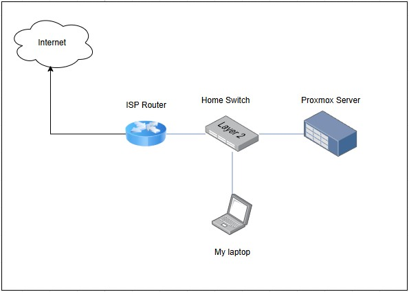
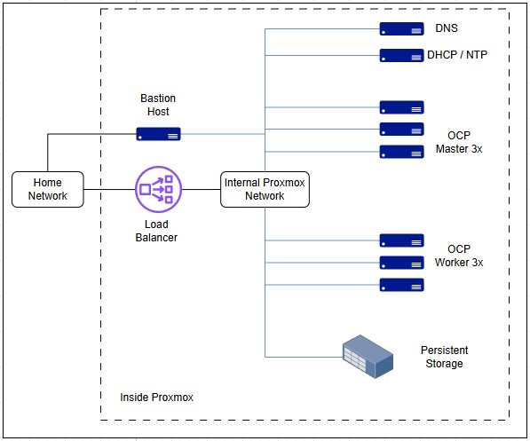

# openshift_hard_way
Welcome to my adventure learning openshift. 
And before you are asking why I am doing this way, remember, I am learning and doing it the hard way!

## Scenario
I am trying to replicate the same scenario as I encountered in the companies I worked for. Usually they are:

* Offline environment (cluster does not have access to the internet).
* Different machines for each service (company wild load balance, DNS, DHCP managed by different servers)
* Network segregation (multiple networks for each part of the cluster)

## Testing Environment
To see how my lab is configured and how it looks. Please check my [dev.to](http://dev.to) blog post.

[Building my home lab](https://dev.to/andre_rocha_b9cf185456d05/building-my-home-lab-10ff)
[Install Proxmox 9](https://dev.to/andre_rocha_b9cf185456d05/installing-proxmox-9-4c8l)

## Topology
I will be running everything into my proxmox server. The physical layer will look like this

The virtual portion will be more like this:

### DNS
* You need a properly configured DNS zone.
* Forward and reverse DNS records for all nodes.
* Wildcard DNS entry for application routes (e.g. *.apps.cluster.example.com).
* Internal name resolution between nodes.

### Load Balancer
Balances traffic for:
* API servers (port 6443 – control plane access).
* Ingress controllers (HTTP/HTTPS routes for applications).

### NTP (Network Time Protocol)
All cluster nodes need synchronized time.

### DHCP
Not strictly required if you use static IP addressing.
Helps in labs or dynamic environments for auto-provisioning.

### External Storage
For production workloads, you need persistent storage.
Options: NFS, iSCSI, Ceph/Rook, NetApp, Portworx, or cloud-native (EBS, Azure Disk, GCP PD).

## Building the VMs
Please refer to the [README.md](vm-build/README.md) file inside the vm-build folder.